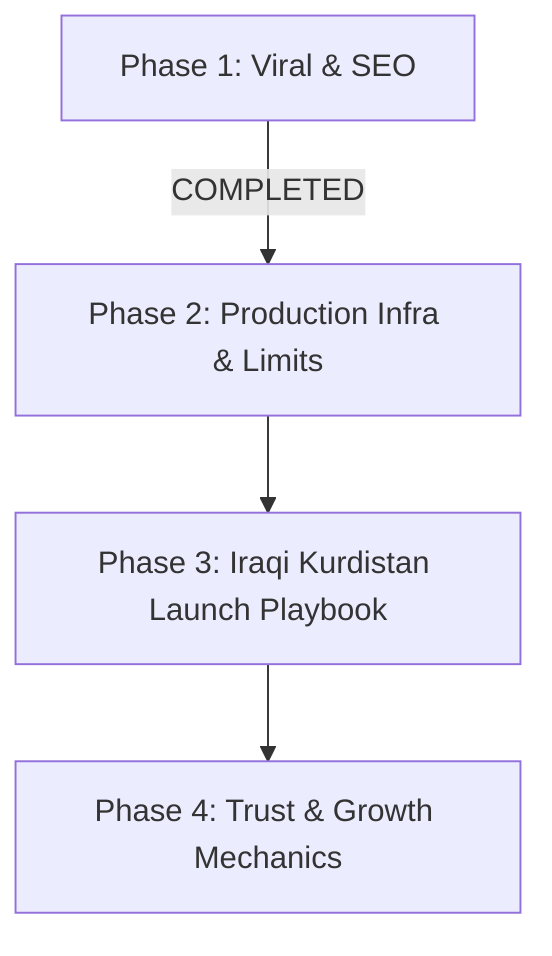

# BenawBara — Session Handoff & Production Master Plan

> **Purpose**: This document provides everything needed for a fresh AI session or developer to resume building, deploying, and growing **BenawBara** without asking redundant questions. Read top to bottom before executing code.

---

## 1. Project Overview & Vision

**BenawBara (بەناو بارا)** is a fast, lightweight, and culturally tailored peer-to-peer (C2C) neighborhood marketplace designed specifically for **Iraqi Kurdistan** (Erbil, Sulaymaniyah, Duhok, Kirkuk, Halabja).

### Core Pillars
1. **Frictionless Buyer-Seller Contact**: Direct WhatsApp integration (`wa.me`) with prefilled Kurdish Sorani inquiries. In Iraqi Kurdistan, users distrust complex in-app checkout/escrow; transactions happen locally in cash or FastPay/FIB after direct WhatsApp communication.
2. **Kurdish Sorani (کوردیی ناوەندی) & True RTL**: Built natively for right-to-left layout with Noto Kufi Arabic typography, Sorani localization, and ticket-style price tags in Iraqi Dinars (IQD).
3. **Mobile-First & PWA Ready**: Optimized for 360px–430px smartphone viewports with zero horizontal overflow, installable on Android and iOS home screens as a standalone Progressive Web App.
4. **Optimized for Supabase Free Tier**: Client-side image compression guarantees WebP uploads under 1 MB, preventing storage exhaustion.

---

## 2. Tech Stack & Critical Conventions

| Layer | Technology | Details / Critical Rules |
|---|---|---|
| **Framework** | **Next.js 16.2.10 (App Router)** | **CRITICAL**: Next.js 16 has breaking changes. Bundled docs in `node_modules/next/dist/docs/`. |
| **Routing Proxy** | `src/proxy.ts` | **DO NOT use `middleware.ts`**. Next.js 16 deprecates `middleware.ts` in favor of `proxy.ts` with `export function proxy()`. |
| **Language & React** | **TypeScript 5 + React 19.2.4** | React 19 Server Actions (`useActionState`, `useTransition`), Server Components by default. |
| **Styling** | **Tailwind CSS v4** | `@theme inline` in `src/app/globals.css`. Uses logical RTL utilities (`ps-`, `pe-`, `start-`, `end-`). |
| **Backend & DB** | **Supabase (PostgreSQL 15)** | Auth, Database, Storage, and Row Level Security (RLS). Hosted in Frankfurt (`eu-central-1`). |
| **Auth & SSR** | `@supabase/ssr` ^0.12.2 | Cookie-based session sync between client, server actions, and proxy. |
| **Static Data Access** | `@supabase/supabase-js` | **RULE**: Never use cookie-based server client in static/revalidated routes (like `sitemap.ts`). Use standalone `createClient(URL, ANON_KEY)`. |
| **Image Compression**| `browser-image-compression` | Dual-pass client-side compression to WebP `< 1 MB` before Supabase Storage upload. |
| **Typography** | Google Fonts (`next/font/google`)| Noto Kufi Arabic (primary Kurdish UI), Fraunces (brand mark), IBM Plex Mono (price tickets). |
| **Hosting & CI/CD** | **Vercel** | Automated continuous deployment on push to `origin/master`. |

---

## 3. Database Architecture & Migrations

All SQL migrations live in `supabase/migrations/`:

### 3.1 `profiles` Table (`supabase/migrations/20260715_create_profiles.sql`)
- Primary Key: `id` (uuid, references `auth.users(id)`).
- Fields: `name` (text), `location` (text), `phone` (text), `updated_at` (timestamptz).
- Trigger: `handle_new_user()` auto-inserts blank profile on user signup.
- RLS: Public read (for listing seller info); user-only update (`auth.uid() = id`).

### 3.2 `listings` Table (`supabase/migrations/20260715_create_listings.sql`)
- Fields: `id` (uuid), `seller_id` (uuid references `profiles(id)`), `title` (text), `description` (text), `price` (bigint, in IQD), `category` (text), `location` (text), `emoji` (text), `sold` (boolean), `created_at` (timestamptz).
- Added in migration `20260715_create_listing_photos.sql`: `image_path` (text, e.g. `{seller_id}/{uuid}.webp`).
- RLS: Public read; insert requires `auth.uid() = seller_id`; update/delete requires owner.

### 3.3 Storage Bucket (`listing-photos`)
- Public bucket for product images.
- Storage RLS: Public read; insert/update/delete restricted to objects under the folder matching `auth.uid()`.

### 3.4 `reports` Table (`supabase/migrations/20260921_create_reports.sql`)
- Fields: `id` (uuid), `listing_id` (uuid references `listings(id)`), `reporter_id` (uuid references `auth.users(id)`), `reason` (text), `notes` (text), `created_at` (timestamptz).
- RLS: Insert allowed by authenticated users; select restricted to admin/service role.

---

## 4. Current State & Completed Features

### 4.1 Core Architecture & Authentication
- **Email/Password Auth**: `src/app/actions/auth.ts`, `src/app/login/page.tsx`, `src/app/login/login-form.tsx`.
- **Session Refresh & Protection**: `src/proxy.ts` refreshes session cookies via `supabase.auth.getUser()`, redirects unauthenticated users to `/login`, and redirects users with incomplete profiles to `/profile-setup`.
- **Password Reset Flow**:
  - `src/app/auth/callback/route.ts` detects recovery tokens (`type=recovery`, `recovery_sent_at`, AMR flags) and redirects strictly to `/reset-password` (never to `/`).
  - `src/app/reset-password/page.tsx` provides clean two-field password reset with Kurdish validation and visibility toggles.

### 4.2 Mobile Responsiveness & Layout Guardrails
- Root viewport configured with `width: "device-width", initialScale: 1` in `src/app/layout.tsx`.
- Strict overflow protection: `html, body { max-width: 100vw; overflow-x: hidden; position: relative; }` in `src/app/globals.css`.
- Feed controls (`src/app/page.tsx`) wrap gracefully (`flex-col sm:flex-row`) with scrollable category and sort chips (`overflow-x-auto scrollbar-none`).
- Listing seller card stacks vertically on mobile (`flex-col sm:flex-row`) preventing WhatsApp button overflow.

### 4.3 Free-Tier Storage & Image Optimization
- Client-side validation in `src/app/listings/listing-form.tsx` enforces image-only uploads (`accept="image/*"`, extension & MIME check).
- Dual-pass compression via `browser-image-compression`:
  - Pass 1: `maxSizeMB: 0.8`, `maxWidthOrHeight: 1600`, `initialQuality: 0.85`, output `image/webp`.
  - Pass 2 (fallback): Automatic re-compression if output exceeds 1 MB.
- Images occupy 250 KB – 700 KB on Supabase Storage (allowing 1,500–3,000 listings on free 1 GB tier).

### 4.4 Marketplace Features & CRUD
- **Browse & Feed**: Real-time search (`?search=`), category filter chips, and sorting (Newest, Price Low→High, Price High→Low) in `src/app/page.tsx`.
- **Listing Creation & Editing**: Unified `src/app/listings/listing-form.tsx` supporting draft preview, dynamic category emojis, and automatic previous image cleanup.
- **Listing Details**: `src/app/listings/[id]/page.tsx` with high-resolution image viewer, ticket price tag, Kurdish relative time, seller card, and owner actions (Mark Sold / Delete / Edit).
- **User Dashboard**: `src/app/my-listings/page.tsx` with Active and Sold tabs and quick management actions.
- **Reporting System**: `src/app/listings/[id]/report-modal.tsx` with Sorani violation categories.

### 4.5 Viral Growth, Sharing & SEO (Latest Additions)
- **Dynamic OpenGraph Previews**: `generateMetadata` in `src/app/listings/[id]/page.tsx` injects title, formatted IQD price, Kurdish description, and listing photo for rich link previews on WhatsApp, Viber, Telegram, and Facebook.
- **Interactive Share Button**: `src/app/listings/[id]/share-button.tsx` triggers native mobile share sheet (`navigator.share`) with fallback to WhatsApp direct share and clipboard copy.
- **Progressive Web App (PWA)**:
  - App icons in `public/` (`icon.png`, `icon-192.png`, `icon-512.png`, `apple-touch-icon.png`).
  - Web manifest generated via `src/app/manifest.ts` with standalone mode and custom palette colors.
  - Apple touch icon and web app capability declared in `src/app/layout.tsx`.
- **Search Engine Discovery**:
  - `src/app/robots.ts` allows listing indexing while protecting user-private routes.
  - `src/app/sitemap.ts` hourly revalidated sitemap indexing all active listings.

---

## 5. Build & Quality Verification

- **Lint Status**: `npm run lint` passes with **0 errors, 0 warnings**.
- **Build Status**: `npm run build` compiles **13 routes** cleanly:
  - `○ /` (Home Feed)
  - `○ /_not-found`
  - `ƒ /auth/callback` (Auth PKCE & Recovery Exchange)
  - `ƒ /listings/[id]` (Dynamic Listing Details + OpenGraph)
  - `ƒ /listings/[id]/edit` (Listing Edit Form)
  - `ƒ /listings/new` (Listing Creation)
  - `ƒ /login` (Authentication)
  - `○ /manifest.webmanifest` (PWA Manifest)
  - `ƒ /my-listings` (User Dashboard)
  - `ƒ /profile-setup` (Profile Onboarding & Edit)
  - `ƒ /reset-password` (Password Reset)
  - `○ /robots.txt` (SEO Robots)
  - `ƒ /sitemap.xml` (Dynamic Hourly Sitemap)

---

## 6. The Master Production Plan to Resume

The following roadmap outlines the exact phases required to publish, harden, and make BenawBara a successful marketplace in Iraqi Kurdistan.



### Phase 2: Production Infrastructure & Free-Tier Guardrails (NEXT TO EXECUTE)

#### Step 2.1: Supabase Custom SMTP Configuration (CRITICAL BUG PREVENTION)
> **Problem**: Supabase's default email provider has a hard limit of **3 to 4 emails per hour**. In production, users will fail to receive password reset emails or signup links.
>
> **Action Required**:
> 1. Sign up for a free email delivery service:
>    - **Resend** (Recommended: 3,000 free emails/month, fastest setup) at `resend.com`
>    - OR **Brevo / Sendinblue** (300 free emails/day) at `brevo.com`
> 2. In Supabase Dashboard:
>    - Navigate to: **Project Settings** → **Authentication** → **SMTP Settings**.
>    - Enable **Custom SMTP**.
>    - Host: `smtp.resend.com` (Port `465` or `587`).
>    - User: `resend`.
>    - Password: `<RESEND_API_KEY>`.
>    - Sender Email: `noreply@yourdomain.com` (or verified domain).

#### Step 2.2: Supabase Free-Tier Inactivity Pause Prevention
> **Problem**: Supabase free projects pause automatically after **7 days of no incoming database queries**. If paused, users visiting the site will see a blank screen or 500 error.
>
> **Solution**:
> - Set up a free automated cron ping to keep the project active:
>   - Option A: Use **UptimeRobot** (free) to ping `https://<project-ref>.supabase.co/rest/v1/` with the anon key header every 24 hours.
>   - Option B: Use **GitHub Actions** scheduled workflow (`cron: '0 6 */2 * *'`) running a curl request to the Supabase REST endpoint.
>   - Option C: Add a Vercel Cron job calling an internal health check API route `/api/health` that selects 1 row from `listings`.

#### Step 2.3: Production Domain & Vercel Configuration
1. Register a short, memorable Kurdish brand domain (e.g., `benawbara.com`, `benawbara.krd`, or `benawbara.net`).
2. Add domain in Vercel Dashboard → Project Settings → Domains.
3. Update Supabase Auth URL Configuration:
   - Navigate to **Authentication** → **URL Configuration**.
   - Site URL: `https://benawbara.com`
   - Redirect URLs:
     - `https://benawbara.com/**`
     - `https://benawbara.com/auth/callback`
     - `https://benawbara.com/reset-password`
     - `http://localhost:3000/**` (for local dev).

#### Step 2.4: Storage Cleanup on Delete / Update
- When a listing is deleted or its image is replaced, ensure the old file in Supabase Storage (`listing-photos/{userId}/{uuid}.webp`) is deleted via `supabase.storage.from("listing-photos").remove([oldPath])`. (Implemented in `src/app/actions/listings.ts`, ensure continuous monitoring).

---

### Phase 3: Iraqi Kurdistan Cold-Start & Go-To-Market Playbook

A classifieds marketplace cannot launch empty. Kurdish buyers leave immediately if there are only 2 items on the feed.

#### Step 3.1: Supply-First Seeding (The "30 Initial Listings" Rule)
- Before announcing the platform, seed **30 to 50 realistic, high-quality listings**:
  - Focus on 2 major cities: **Erbil (هەولێر)** and **Sulaymaniyah (سلێمانی)**.
  - Target key neighborhoods: Ankawa, Bakhtiari, Dream City, 100M Road, Suly Salim Street, Sarchinar.
  - High-velocity categories:
    - **Smartphones**: iPhone 13/14/15 Pro Max, Samsung Galaxy S23/S24.
    - **Cars & Motorcycles**: Toyota Camry, Hyundai Elantra, Kia Sportage.
    - **Kurdistan Real Estate**: Apartment rentals in Erbil/Sulaymaniyah.
    - **Gaming & Laptops**: PlayStation 5, gaming PCs.

#### Step 3.2: Kurdish Social Distribution Channels
- **Kurdish Facebook Groups**: The #1 marketplace engine in Kurdistan.
  - Groups: *بازاڕی ئۆنلاین لە کوردستان*, *کڕین و فرۆشتنی ئۆتۆمبێل هەولێر*, *بازاڕی سلێمانی*.
  - Strategy: Share listing links directly; the newly built OpenGraph tags will display rich preview cards with the photo, IQD price, and title.
- **Telegram Channels**: Kurdish tech and second-hand trading channels.
- **Instagram & TikTok Micro-Reels**:
  - 10-second screen recordings showcasing: "ئاسانترین ڕێگا بۆ فرۆشتنی کەلوپەلەکانت لە هەولێر و سلێمانی بەبێ دەڵاڵ" (The easiest way to sell your items in Erbil and Sulaymaniyah without brokers).

#### Step 3.3: Why WhatsApp is the Primary Conversion Channel
- Kurdish users do not want to register credit cards or wait 3 days for shipping.
- The workflow must remain:
  `Browse Item → Tap "پەیوەندی بە واتساپ" → Direct Voice Note / Negotiation → In-Person Handshake or FastPay / FIB Transfer`.

---

### Phase 4: Trust, Safety & Engagement Mechanics

1. **Verified Seller Badges (نیشانەی فرۆشیاری باوەڕپێکراو)**:
   - Add a `verified` boolean to the `profiles` table.
   - Display a verified checkmark badge on listings from trusted or identity-checked sellers.
2. **Listing Bump / Refresh Mechanism (تازەکردنەوەی ڕاگەیەنراو)**:
   - Allow sellers to bump their listing to the top of the feed once every 48 hours without re-creating it.
   - Updates `created_at = now()` on the listing row.
3. **Analytics & Performance Tracking**:
   - Install `@vercel/analytics` and `@vercel/speed-insights` for zero-configuration, privacy-compliant tracking of page visits, popular categories, and bounce rates.

---

## 7. Complete Project File Tree

```
c:\Users\sarda\BenawBara\
├── public/
│   ├── apple-touch-icon.png         ← 180x180 iOS home screen icon
│   ├── icon-192.png                 ← 192x192 Android PWA icon
│   ├── icon-512.png                 ← 512x512 PWA splash icon
│   └── icon.png                     ← Default app favicon
├── src/
│   ├── app/
│   │   ├── actions/
│   │   │   ├── auth.ts              ← signInWithPassword, signUpWithPassword, signOut, requestPasswordReset
│   │   │   ├── listings.ts          ← createListing, updateListing, toggleSold, deleteListing
│   │   │   ├── profile.ts           ← updateProfile
│   │   │   └── reports.ts           ← submitReport
│   │   ├── auth/
│   │   │   └── callback/
│   │   │       └── route.ts         ← PKCE code exchange & recovery redirect handler
│   │   ├── listings/
│   │   │   ├── [id]/
│   │   │   │   ├── edit/
│   │   │   │   │   └── page.tsx     ← Listing edit page
│   │   │   │   ├── page.tsx         ← Listing detail view + OpenGraph metadata
│   │   │   │   ├── report-modal.tsx ← Listing report modal dialog
│   │   │   │   └── share-button.tsx ← Native Web Share & WhatsApp share button
│   │   │   ├── new/
│   │   │   │   └── page.tsx         ← Create new listing page
│   │   │   └── listing-form.tsx     ← Unified form with dual-pass WebP compression
│   │   ├── login/
│   │   │   ├── login-form.tsx       ← Email/password signin & signup form
│   │   │   └── page.tsx             ← Login page
│   │   ├── my-listings/
│   │   │   └── page.tsx             ← User dashboard (active/sold tabs)
│   │   ├── profile-setup/
│   │   │   ├── profile-form.tsx     ← Name, neighborhood, WhatsApp number form
│   │   │   └── page.tsx             ← Profile onboarding and edit page
│   │   ├── reset-password/
│   │   │   └── page.tsx             ← Password reset page
│   │   ├── globals.css              ← Design tokens, ticket price tag, RTL rules
│   │   ├── layout.tsx               ← Root layout, fonts, viewport, PWA metadata
│   │   ├── manifest.ts              ← Web App Manifest (PWA)
│   │   ├── page.tsx                 ← Main feed (search, category chips, sort, FAB)
│   │   ├── robots.ts                ← Crawler directives (robots.txt)
│   │   └── sitemap.ts               ← Dynamic hourly sitemap generator
│   ├── lib/
│   │   ├── supabase/
│   │   │   ├── client.ts            ← Browser Supabase client
│   │   │   ├── server.ts            ← Server Supabase client (cookie-based)
│   │   │   └── storage.ts           ← Storage bucket helpers & URL builders
│   │   └── strings.ts               ← Central Kurdish Sorani dictionary & labels
│   └── proxy.ts                     ← Next.js 16 session refresh & route guard
├── supabase/
│   └── migrations/
│       ├── 20260715_create_profiles.sql
│       ├── 20260715_create_listings.sql
│       ├── 20260715_create_listing_photos.sql
│       └── 20260921_create_reports.sql
├── .env.local                       ← Supabase URL, anon key, service role key
├── AGENTS.md                        ← Next.js 16 agent rules
├── handoff.md                       ← THIS MASTER HANDOFF FILE
├── next.config.ts                   ← Supabase image domains & Turbopack root
├── package.json                     ← Dependencies & scripts
└── tsconfig.json                    ← TypeScript config
```

---

## 8. Immediate Action Items for the Next Session

When resuming in a new chat session, execute the following steps in order:

1. **Commit and Push Current Pending Changes**:
   ```bash
   git add .
   git commit -m "feat: add opengraph previews, share button, pwa manifest, sitemap, and robots"
   git push origin master
   ```
2. **Run Build & Test**:
   ```bash
   npm run lint
   npm run build
   ```
3. **Execute Phase 2 (Infrastructure)**:
   - Guide the user to configure Custom SMTP in Supabase (Resend).
   - Set up an automated ping to prevent Supabase 7-day inactivity pause.
4. **Execute Phase 4.1 & 4.2 (Product Enhancements)**:
   - Implement the "Bump Listing" (تازەکردنەوە) feature for sellers.
   - Add `@vercel/analytics` for live user traffic metrics.
